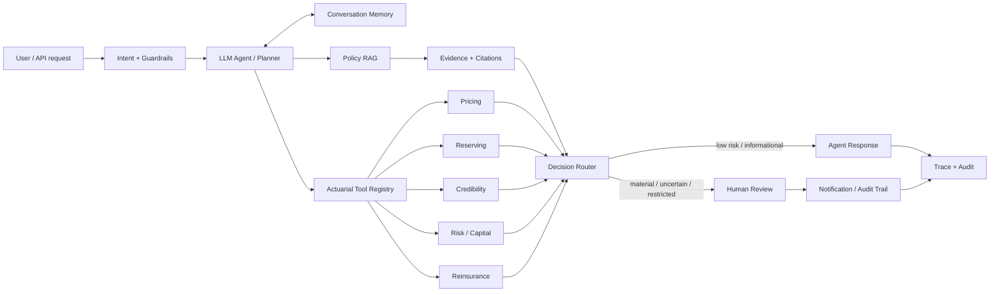

# ActuaryFlow-AI

A research-oriented Python platform for **human-governed actuarial insurance AI** built around the workflow:

**user request → LLM agent → memory → policy RAG → actuarial tools → decision router → human review / notification**

The repository is designed as a modular research system rather than a single prompt wrapper. It separates agent orchestration, policy retrieval, actuarial computation, governance, evaluation, and human review so each subsystem can be tested independently.

## Core architecture



## Research modules

- **Agent orchestration** — intent detection, planning, memory, tool policy, guardrails, session state, tracing, API and CLI surfaces.
- **Policy RAG** — policy ingestion, splitting, retrieval, hybrid retrieval utilities, metadata filtering, citation generation, and retrieval evaluation.
- **Actuarial engine** — pricing, discounting, claim frequency/severity utilities, reserving, credibility, reinsurance, capital/risk, Monte Carlo, diagnostics, and a tool registry.
- **Governance layer** — authority rules, audit events, provenance, redaction, human-review routing, fairness checks, monitoring, notifications, model-risk controls, and a risk register.
- **Evaluation** — agent cases, retrieval queries, governance scenarios, red-team cases, metrics, and report helpers.
- **Research documentation** — orchestration, RAG design, actuarial methods, threat model, privacy, human review, fairness, governance, memory, and tool protocol notes.

## Repository layout

```text
ActuaryFlow-AI/
├── config/                  # agent, retrieval, governance, risk thresholds
├── data/policies/           # demo insurance policy corpus
├── docs/                    # research and architecture documentation
├── eval/                    # agent, retrieval, governance and red-team cases
├── examples/                # example requests and responses
├── prompts/                 # system prompt material
├── scripts/                 # runnable demos and evaluation scripts
├── src/actuaryflow/
│   ├── agent/               # LLM agent orchestration
│   ├── actuarial/           # actuarial computation engine
│   ├── rag/                 # policy retrieval and citations
│   ├── governance/          # human governance and safety controls
│   └── evaluation/          # evaluation utilities
├── templates/               # audit/review/notification payload templates
├── tests/                   # unit tests by subsystem
└── pyproject.toml
```

## Example decision philosophy

ActuaryFlow-AI is intended for **decision support**, not autonomous binding insurance decisions. A request can be answered automatically when it is informational and sufficiently supported, while material decisions, missing evidence, high uncertainty, restricted actions, or governance triggers should be routed to a human reviewer.

The agent should preserve provenance for retrieved policy passages and actuarial outputs so a reviewer can inspect what evidence and computation affected a recommendation.

## Example capabilities

Typical research scenarios include:

- explain policy coverage using retrieved policy evidence;
- estimate indicated premium from exposure, expected loss and loading assumptions;
- calculate present values and simple capital/risk measures;
- run basic reserving calculations;
- apply credibility-style weighting;
- evaluate reinsurance layers;
- simulate aggregate loss with Monte Carlo utilities;
- route high-impact or uncertain cases to human review;
- redact sensitive content before audit/notification flows;
- evaluate retrieval quality, governance behavior and red-team cases.

## Installation

Requires Python 3.11+.

```bash
python -m venv .venv
source .venv/bin/activate       # Linux/macOS
# .venv\Scripts\activate        # Windows PowerShell

pip install -e ".[dev]"
```

Copy environment defaults if needed:

```bash
cp .env.example .env
```

## Run the demo agent

```bash
python scripts/run_agent_demo.py
```

The package also exposes a CLI entry point after installation:

```bash
actuaryflow --help
```

## Run tests

```bash
pytest
```

Useful development checks:

```bash
ruff check .
mypy src/actuaryflow
```

## Evaluation

Retrieval evaluation:

```bash
python scripts/evaluate_retrieval.py
```

Governance evaluation:

```bash
python scripts/run_governance_eval.py
```

Evaluation datasets are intentionally small, transparent research fixtures that can be expanded into larger benchmark suites.

## Human-governed workflow

A production-grade insurance workflow should distinguish between:

1. **Evidence acquisition** — policy RAG and structured inputs.
2. **Reasoning / planning** — the LLM decides which tools are required.
3. **Deterministic computation** — actuarial functions calculate numeric outputs.
4. **Decision routing** — governance rules classify the action and uncertainty.
5. **Human review** — material or restricted cases require approval.
6. **Notification and audit** — decisions, evidence, computations and reviewer actions are recorded.

This separation is central to the project: the LLM is not treated as the source of actuarial arithmetic or policy truth.

## Research branches

The repository was developed with separate research tracks for:

- `research/agent-orchestration`
- `research/rag-actuarial-engine`
- `research/governance-evaluation`
- `research/workflow-docs`

Their implemented components have been integrated into `main` while preserving the research branches for later comparison and experimentation.

## Current status

`main` now contains the integrated Python research scaffold covering the full flow from agent intake through retrieval, actuarial tooling, governance, human review and evaluation. The codebase is intentionally modular so future work can add vector databases, stronger embedding/reranking models, production LLM providers, persistent memory, calibrated uncertainty, stochastic reserving models, richer pricing models, workflow orchestration, observability, and deployment infrastructure.

## Important note

This repository is a research and software-engineering project. Example actuarial functions, policy documents, thresholds, and governance rules are illustrative and are not a substitute for insurer-approved models, qualified actuarial judgment, legal review, or jurisdiction-specific compliance.

## License

MIT License. See `LICENSE`.
